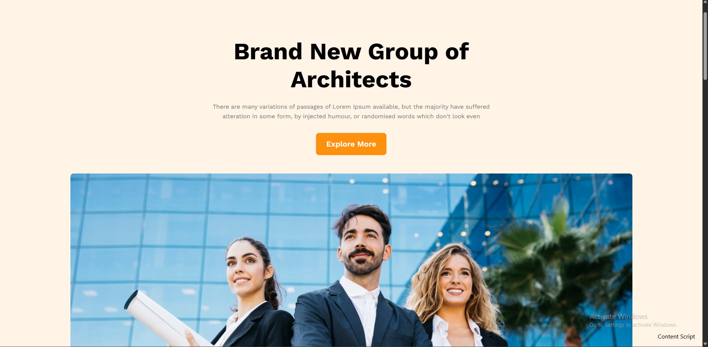

# 🏛️ G3 Architect

**G3 Architect** is a modern, responsive architectural landing page website. It's designed to present architectural services or portfolios with a clean and elegant layout.

🔗 **Live Preview:** [Click here to view the project](https://gaziraihan1.github.io/g3-architect-website/)

---

## 📌 Features

- 🏢 **About Section** — Showcasing details about the architect or company
- 📞 **Contact Section** — Visitors can reach out or leave messages
- 🔐 **Login Feature** — Basic login interface for users (non-authenticated)

---

## 🖼️ Screenshot


---

## 🛠️ Technologies Used

- **HTML5**
- **CSS3**
- **Vanilla JavaScript**
- **Responsive Design Principles**

---

## 📁 Project Structure

```
g3-architect-website/
├── index.html          # Main HTML file
├── style.css           # CSS file for layout and styling
├── images/            # Folder containing logos, icons, and screenshots
```

## 📦 How to Use / Copy the Project

You can clone this project to your local machine using Git:

### 🔁 Clone the Repository

```bash
git clone https://github.com/gaziraihan1/g3-architect-website.git
```

### Change directory

```bash
cd g3-architect-website
```
